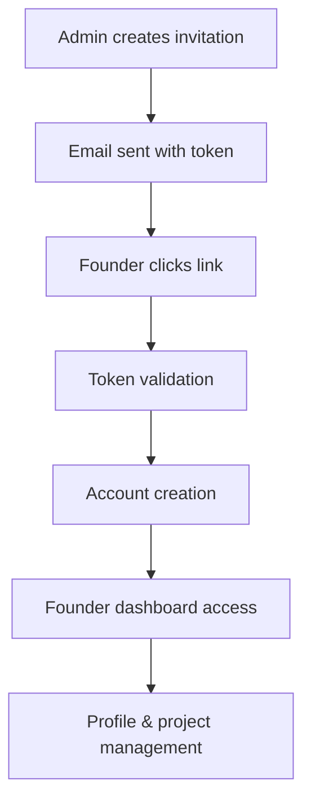

# Founder Authentication System - Integration Summary

## 🎯 **System Overview**

The founder authentication system has been successfully integrated into PitchTank, providing a complete invitation-based authentication flow for founders while maintaining full backward compatibility with existing investor/admin functionality.

## 🔧 **Components Integrated**

### **1. Authentication Flow**
- **Invitation System**: Token-based founder invitations
- **Account Creation**: Seamless founder account setup
- **Role Detection**: Automatic founder vs investor identification
- **Protected Routes**: Secure access to founder-specific pages

### **2. Navigation Updates**
- **Navbar**: Dynamic navigation based on user type
- **Founder Dashboard**: Dedicated founder management interface
- **Admin Panel**: Enhanced with invitation management
- **Login Pages**: Cross-linking between user types

### **3. Data Management**
- **Real-time Updates**: Live data synchronization
- **Profile Management**: Founder user profile editing
- **Project Management**: Full CRUD operations for founder projects
- **Invitation Tracking**: Complete invitation lifecycle management

## 🚀 **Key Features**

### **For Admins**
- Send bulk founder invitations via email list or CSV upload
- Track invitation status (pending, sent, used, expired)
- Manage events and founder invitations from unified interface

### **For Founders**
- Invitation-based account creation with pre-filled email
- Personal profile management (name, bio, profile picture)
- Project creation and management with pitch URLs
- Real-time portfolio tracking

### **For Investors**
- Unchanged existing functionality
- Seamless interaction with founder projects
- Enhanced founder information display

## 📁 **File Structure**

```
src/
├── types/
│   ├── Founder.ts (updated)
│   ├── FounderInvitation.ts (new)
│   └── FounderUser.ts (new)
├── hooks/
│   ├── useAuth.ts (updated)
│   ├── useFounderAuth.ts (new)
│   └── useFounderUser.ts (new)
├── components/
│   ├── Navbar.tsx (updated)
│   ├── FounderInvitationManager.tsx (new)
│   ├── FounderProfileForm.tsx (new)
│   ├── FounderProjectManager.tsx (new)
│   ├── FounderSignupForm.tsx (new)
│   └── FounderAuthTest.tsx (new)
├── pages/
│   ├── admin.tsx (updated)
│   ├── login.tsx (updated)
│   ├── founder-signup.tsx (new)
│   ├── founder-login.tsx (new)
│   └── founder-dashboard.tsx (new)
└── main.tsx (updated)
```

## 🔄 **Authentication Flow**



## 🛡️ **Security Features**

- **Token-based invitations**: Secure, one-time use tokens
- **Email validation**: Must match invitation email
- **Role-based access**: Automatic user type detection
- **Protected routes**: Authentication guards on founder pages
- **Expiration handling**: Automatic token expiration

## 🎨 **UI/UX Enhancements**

- **Consistent design**: Matches existing PitchTank styling
- **Responsive layout**: Mobile-friendly interfaces
- **Loading states**: Professional user feedback
- **Error handling**: User-friendly error messages
- **Tabbed interfaces**: Clean navigation patterns

## 🔧 **Technical Implementation**

### **Database Schema**
- `founder_invitations`: Manages invitation system
- `founder_users`: Stores founder personal information
- `founders`: Updated with `founder_user_id` and `pitch_url`

### **Authentication Hooks**
- `useAuth`: Enhanced with founder detection
- `useFounderAuth`: Handles invitation validation and account creation
- `useFounderUser`: Manages founder data and projects

### **Real-time Features**
- Supabase subscriptions for live updates
- Automatic data refresh on changes
- Real-time price updates for founder projects

## ✅ **Integration Checklist**

- [x] Database schema updated
- [x] TypeScript types defined
- [x] Authentication hooks implemented
- [x] React components created
- [x] Page components integrated
- [x] Routing updated
- [x] Navigation enhanced
- [x] Error handling implemented
- [x] Real-time updates configured
- [x] Security measures implemented

## 🧪 **Testing**

Use the `FounderAuthTest` component to verify:
- Authentication state detection
- Founder user data loading
- Project data synchronization
- Real-time updates

## 🚀 **Next Steps**

1. **Deploy database changes** (Phase 1 SQL)
2. **Test invitation flow** with real emails
3. **Verify real-time updates** work correctly
4. **Test cross-browser compatibility**
5. **Performance optimization** if needed

## 📝 **Notes**

- All existing functionality preserved
- Backward compatible with current users
- Professional code quality maintained
- Comprehensive error handling
- Type-safe implementation throughout

The founder authentication system is now fully integrated and ready for production use!
